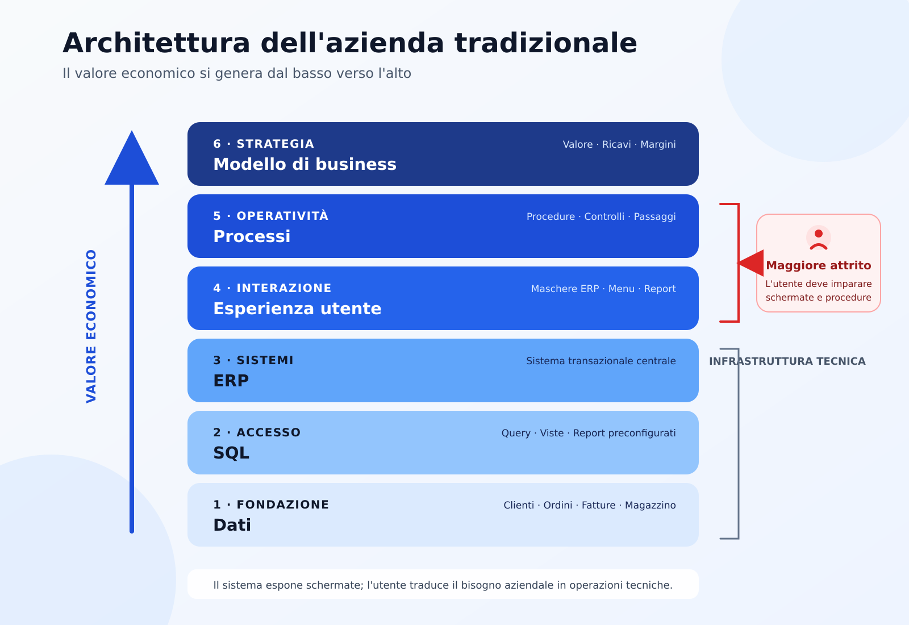
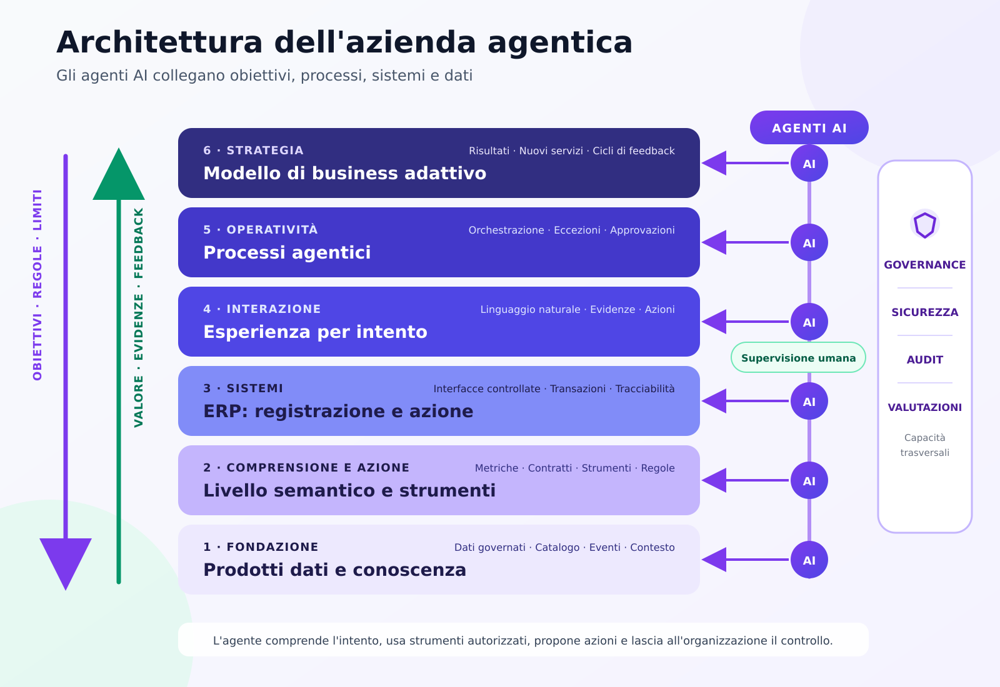

# Architettura dell'impresa agentica

Questo repository propone un modello aperto per trasformare un'azienda tradizionale, centrata su dati, SQL ed ERP, in un'azienda agentica nella quale gli agenti AI intervengono in modo governato nei diversi strati dell'organizzazione.

> Il valore economico continua a generarsi dal basso verso l'alto. Nell'impresa agentica, però, obiettivi, regole e limiti operativi scendono anche dall'alto verso il basso. Gli agenti AI collegano questi due flussi.

## Perché esiste questo repository

Le iniziative di intelligenza artificiale aziendale falliscono spesso perché osservano solo una parte del sistema:

- chi possiede esclusivamente competenze tecniche tende a concentrarsi su dati, modelli e interrogazioni;
- chi opera esclusivamente nella consulenza direzionale tende a concentrarsi su processi e modello di business;
- gli utenti operativi rimangono bloccati tra interfacce ERP complesse, procedure manuali e report preconfigurati.

Questo progetto crea un linguaggio comune fra tecnologia, operazioni e strategia. L'agente AI non viene aggiunto come un settimo strato: trasforma e collega tutti e sei gli strati esistenti.

## 1. Architettura dell'azienda tradizionale



Nell'architettura tradizionale:

1. i **dati** contengono i fatti aziendali;
2. il **codice SQL** estrae e aggrega tali fatti;
3. l'**ERP** registra e governa le transazioni;
4. l'**esperienza utente** espone schermate, menu e report;
5. i **processi** coordinano persone, controlli e responsabilità;
6. il **modello di business** definisce come l'azienda crea e cattura valore.

Il maggiore attrito si concentra normalmente tra esperienza utente e processi: le persone devono conoscere il sistema, ricordare sequenze operative e tradurre una domanda aziendale in passaggi tecnici.

## 2. Architettura dell'azienda agentica



Nell'architettura agentica, gli agenti AI operano attraverso tutti gli strati, ma non ricevono accesso indiscriminato. Ogni agente usa dati, strumenti e azioni autorizzati, produce evidenze verificabili e rispetta le regole dell'organizzazione.

| Strato | Azienda tradizionale | Azienda agentica | Intervento degli agenti AI |
| --- | --- | --- | --- |
| 1. Dati | Tabelle, silos e definizioni locali | Prodotti dati governati e conoscenza contestuale | Recuperano soltanto i dati autorizzati e ne mantengono provenienza e contesto |
| 2. SQL | Query manuali e report preconfigurati | Livello semantico, metriche condivise e strumenti tipizzati | Traducono l'intento in interrogazioni controllate senza esporre lo schema all'utente |
| 3. ERP | Applicazione centrale da navigare | Sistema di registrazione e di azione esposto tramite interfacce controllate | Leggono lo stato, preparano transazioni ed eseguono solo le azioni consentite |
| 4. Esperienza utente | Maschere, menu e formazione prolungata | Interazione per intento, evidenze e gestione delle eccezioni | Comprendono la richiesta, spiegano il ragionamento e propongono le prossime azioni |
| 5. Processi | Procedure manuali e passaggi tra funzioni | Flussi agentici orchestrati con supervisione umana | Coordinano attività, scadenze, eccezioni e approvazioni |
| 6. Modello di business | Decisioni basate su report periodici | Modello adattivo guidato da risultati e cicli di feedback | Collegano decisioni operative, indicatori economici e opportunità di innovazione |

## La tesi centrale

L'impresa agentica introduce due flussi complementari:

- **dal basso verso l'alto:** dati, evidenze e transazioni generano risultati operativi e valore economico;
- **dall'alto verso il basso:** strategia, obiettivi, regole e limiti guidano il comportamento degli agenti.

Gli agenti AI costituiscono il tessuto connettivo tra questi flussi. Non sostituiscono automaticamente persone, ERP o processi: riducono il costo di coordinamento e portano il contesto giusto nel punto in cui deve essere presa una decisione.

## Principi architetturali

1. **L'ERP rimane il nucleo transazionale affidabile.** Gli agenti non modificano direttamente il database.
2. **L'utente esprime un intento.** Non deve conoscere tabelle, campi o sequenze di schermate.
3. **Lettura, proposta e azione sono permessi distinti.** Un agente può suggerire un'operazione senza poterla eseguire.
4. **Ogni risultato deve essere verificabile.** Fonti, strumenti utilizzati e passaggi rilevanti devono essere tracciati.
5. **La supervisione umana è proporzionata al rischio.** Più alto è l'impatto, più forte è il controllo.
6. **La sicurezza attraversa tutti gli strati.** Identità, autorizzazioni e segregazione dei compiti non sono componenti opzionali.
7. **Gli agenti lavorano con contratti espliciti.** Dati, strumenti, eventi e output hanno formati definiti e verificabili.
8. **Il successo è economico e operativo.** Si misurano tempi, errori, capitale circolante, margini e qualità delle decisioni.

## Primo caso d'uso: gestione agentica delle eccezioni ordine-incasso

La prima implementazione di riferimento parte da una richiesta concreta:

> Quali ordini bloccati mettono maggiormente a rischio il fatturato? Spiega le cause, proponi le azioni e richiedi l'approvazione prima di intervenire sull'ERP.

Il caso d'uso attraversa l'intera architettura:

- recupera clienti, ordini, disponibilità, fatture e limiti di credito;
- interpreta concetti aziendali come fatturato a rischio, priorità e cliente strategico;
- interroga l'ERP attraverso strumenti autorizzati;
- presenta evidenze, livello di confidenza e possibili conseguenze;
- apre un flusso di approvazione per le azioni sensibili;
- registra ogni decisione e misura ricavi protetti, tempo di ciclo ed errori evitati.

## Struttura prevista del repository

```text
architettura-impresa-agentica/
├── README.md
├── MANIFESTO.md
├── ROADMAP.md
├── documentazione/
│   ├── modello-dei-sei-strati.md
│   ├── governance-e-sicurezza.md
│   ├── modello-di-maturita.md
│   ├── decisioni-architetturali/
│   └── immagini/
├── architettura/
│   ├── modello-canonico/
│   ├── contratti-degli-strumenti/
│   ├── contratti-degli-eventi/
│   └── diagrammi/
├── implementazione-di-riferimento/
│   ├── banco-di-lavoro-agenti/
│   ├── orchestratore/
│   ├── livello-semantico/
│   ├── motore-delle-regole/
│   └── connettori/
│       ├── erp-simulato/
│       ├── business-central/
│       └── sap/
├── esempi/
│   ├── ordine-incasso/
│   ├── acquisto-pagamento/
│   └── contabilita-e-chiusura/
├── valutazioni/
│   ├── scenari/
│   ├── metriche/
│   └── prove-avverse/
└── .github/
    ├── ISSUE_TEMPLATE/
    └── workflows/
```

## Percorso di adozione

Il progetto propone quattro stadi progressivi:

1. **Osservare:** gli agenti leggono e spiegano, senza produrre modifiche.
2. **Proporre:** gli agenti preparano azioni che una persona deve approvare.
3. **Agire entro limiti definiti:** gli agenti eseguono operazioni a basso rischio con controlli preventivi.
4. **Orchestrare:** più agenti coordinano processi trasversali, mantenendo responsabilità, audit e possibilità di arresto.

## Indicatori da misurare

- tempo necessario per ottenere una risposta affidabile;
- numero di passaggi manuali eliminati;
- percentuale di proposte approvate o corrette;
- errori e rilavorazioni evitate;
- tempo medio di gestione delle eccezioni;
- valore economico protetto o generato;
- incidenti di sicurezza e violazioni delle regole;
- qualità delle evidenze e completezza dell'audit.

## Stato del progetto

Il repository nasce come architettura di riferimento aperta. Il primo obiettivo è realizzare un esempio completo, piccolo ma verificabile, che dimostri il collegamento tra tutti e sei gli strati.

